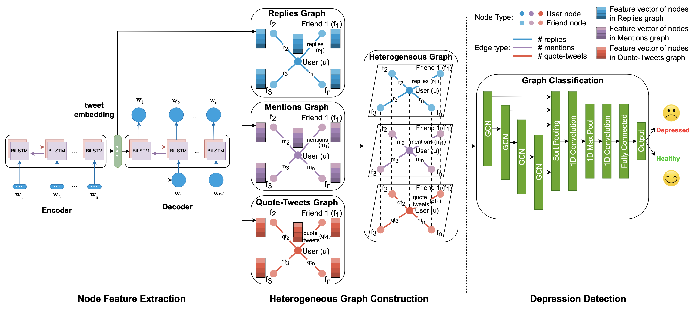

# MentalNet

Heterogeneous Graph Representation for Early Depression Detection

This repository contains a StellarGraph implementation of MentalNet - Heterogeneous Graph Representation for Early Depression Detection. MentalNet is a framework for early detection of depression by capturing the relational data in users’ ego-networks using heterogeneous graph convolution. MentalNet builds on three common types of users’ interactions with their friends on social media (such as Twitter), namely, replies, mentions, and quote-tweets. To the best of our knowledge, our work pilots the first concept among its peers to formulate the problem of depression detection on social media as a graph classification problem by representing users’ social circles as heterogeneous graphs.

## Requirements

StellarGraph (1.2.1), numpy, TensorFlow (<=2.7), numpy, sklearn, networkx. The project should work with no issues on Google Colab with Python 3.7.

## Running the code

Simply run the notebook supplying the train and test users, as well as the replies, mentions, and quote tweets stats.

### Contributors: Ivan Mihov (ivanmihov@csus.edu)

> Ivan Mihov, Haiquan Chen, Xiao Qin, Wei-Shinn Ku, Da Yan, and Yuhong Liu, “MentalNet: Heterogeneous Graph Representation for Early Depression Detection,” in Proceedings of the 22nd IEEE International Conference on Data Mining (ICDM), Orlando, FL, USA, 2022.